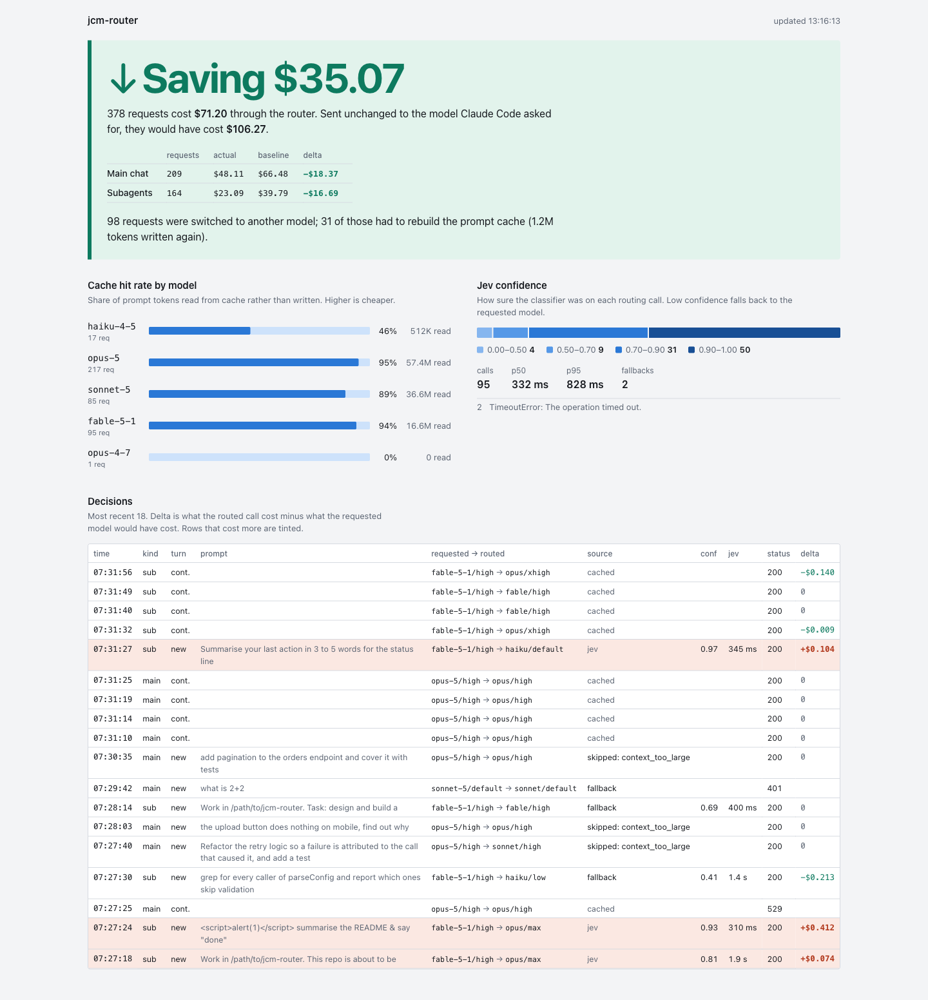
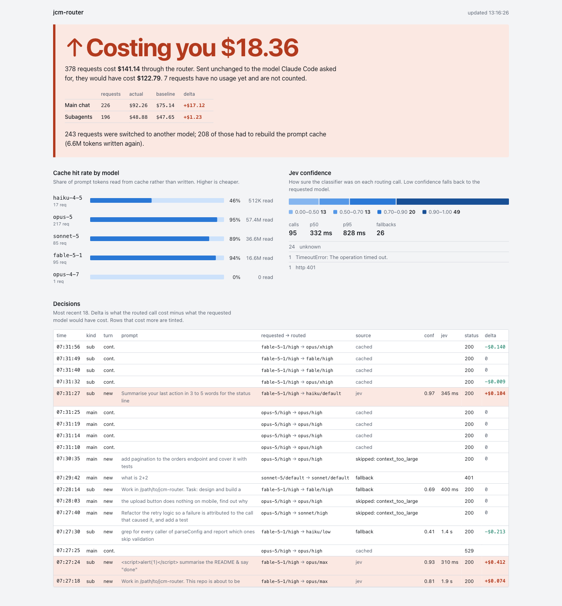
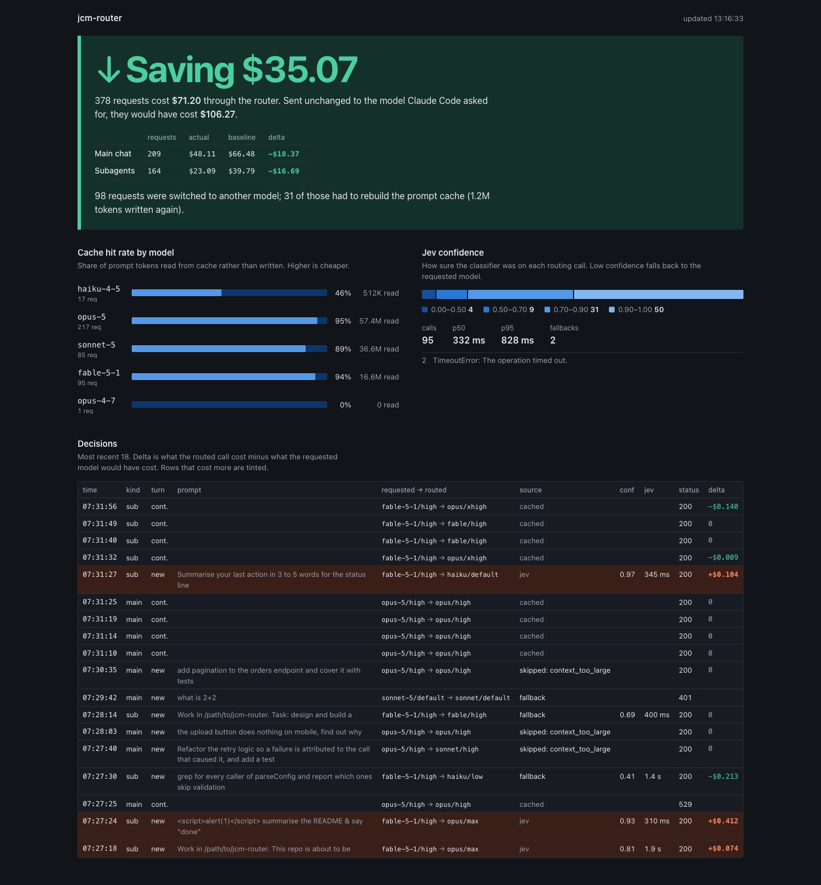
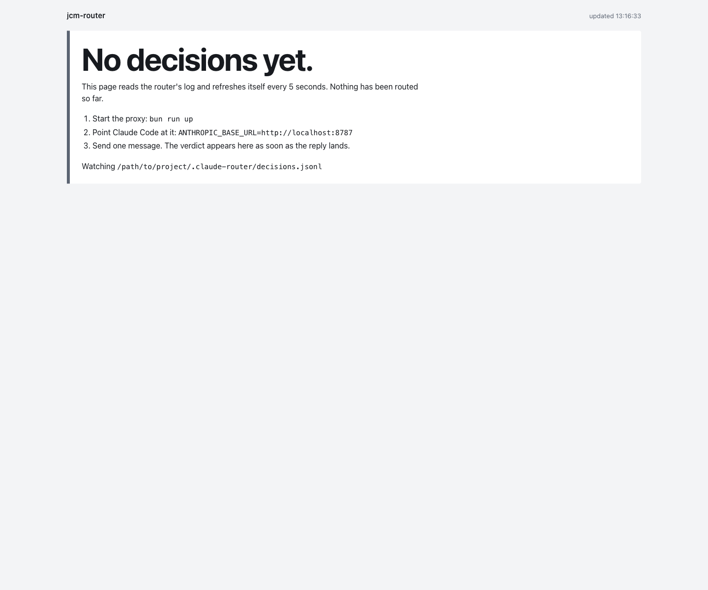

# jcm-router

A local proxy that sits between Claude Code and the Anthropic API and picks the model and effort
level per message, using TypeSafe's Jev classifier. Trivial questions go to Haiku, everyday work to
Sonnet, hard problems to Opus or Fable, and your Claude subscription login keeps working.

The interesting part is what it measured: **routing subagents saves money, routing an established
main chat loses it.** Prompt caches are per model, so switching model mid conversation throws away
the cached prefix and rewrites all of it at cache-write price. A subagent starts cold and has
nothing to lose. A 300K token main chat has everything to lose.

```
Claude Code  --->  jcm-router (localhost:8787)  --->  api.anthropic.com
                        |
                        +--->  api.typesafe.ai (Jev: "which model? how much effort?")
```

## The measured failure

This project lost money before it saved any, and that is the most useful thing in this repo.

An early version routed everything, main chat included. Over 309 logged requests it cost **$106.73**
against an **$87.19** baseline of doing nothing: a **$19.53 loss**, and **$17.12 of that was the main
chat alone**. The logs showed exactly why. On every main-chat switch the response came back with
`cache_read_input_tokens: 0` and `cache_creation_input_tokens: 360370`. The whole conversation was
being rewritten into a new cache at 2x input price instead of read from the old one at 0.1x. No
cheaper model recovers that.

Subagents were the opposite: small, cold contexts, nothing cached to throw away, switching close to
free.

So the router got a cost guard, and now subagents are always routed while the main chat is only
switched when the arithmetic says the switch is cheap. Everything in
[Where switching pays off](#where-switching-pays-off) exists because of that $19.53.

The `baseline` number is not a guess: the dashboard prices every logged request twice, once as it
ran and once on the model Claude Code originally asked for, with switched requests' cache-creation
tokens priced as cache reads (without the router, that history was already cached). Run
`bun run dashboard` against your own log and it will tell you the same thing about your usage.

## Install

Requires [Bun](https://bun.sh), a Claude subscription that Claude Code already logs into, and a
[TypeSafe](https://typesafe.ai) API key.

```sh
git clone https://github.com/<user>/jcm-router.git
cd jcm-router
bun install
cp .env.example .env     # put your TYPESAFE_API_KEY in .env
```

## Run

```sh
bun run up
```

```
jcm-router is up
  proxy      http://localhost:8787   (point Claude Code at this)
  dashboard  http://localhost:8788
  logs       /Users/you/.claude-router/decisions.jsonl
  stop       ctrl-c
```

That runs the proxy and the dashboard together and refuses to start if either port is taken
(`PORT` for the proxy, `--port` for the dashboard). `bun start` runs the proxy on its own.

Then point Claude Code at the proxy, in a second terminal:

```sh
env -u ANTHROPIC_API_KEY ANTHROPIC_BASE_URL=http://localhost:8787 claude
```

`env -u ANTHROPIC_API_KEY` matters: if that variable is set in your shell, Claude Code bills the API
key instead of your subscription. Worth an alias:

```sh
alias clauder='env -u ANTHROPIC_API_KEY ANTHROPIC_BASE_URL=http://localhost:8787 claude'
```

To make it permanent instead, `scripts/env-on.sh` writes `env.ANTHROPIC_BASE_URL` into
`~/.claude/settings.json` (one key, backed up first, needs `jq`). Restart Claude Code afterwards.

### Reverting

```sh
scripts/env-off.sh        # removes that one key from settings.json
# then restart Claude Code, and ctrl-c the proxy
```

> **The proxy must be running.** While `ANTHROPIC_BASE_URL` points at localhost and nothing is
> listening there, Claude Code cannot reach the API at all: every request fails, not just the routed
> ones. If Claude Code suddenly cannot connect, either start the proxy again (`bun run up`) or run
> `scripts/env-off.sh` and restart Claude Code.
>
> Note the precedence: `env.ANTHROPIC_BASE_URL` in `~/.claude/settings.json` **overrides** the shell
> variable, so unsetting it in your shell does not undo `env-on.sh`. Use `env-off.sh`.

## How routing decides

Only `/v1/messages` requests carrying a non-empty `tools` array are routed. Everything else (chat
title generation, other paths) passes straight through.

When the newest message is a real user message (not a `<system-reminder>`, no tool results), the
proxy sends Jev a small state object: the user message (max 6000 chars), the previous assistant
reply (max 2000 chars), and the previous routing for this conversation. Jev answers three questions,
all defined in [`src/routing-policy.ts`](src/routing-policy.ts), which is the whole policy surface:

| Question | Type | What it decides |
| --- | --- | --- |
| `model` | choice | fable, opus, sonnet or haiku, each option describing what belongs there and what belongs in the neighbour instead |
| `effort` | choice | low, medium, high, xhigh or max, by how much deliberation the task needs |
| `is_followup` | yes/no probability | is this a short continuation ("yes do it", "continue") that only makes sense given the previous reply? |

**Confidence gates.** Below `MODEL_MIN_CONFIDENCE` (0.5) the model Claude Code asked for is kept.
`effort` is gated separately at `EFFORT_MIN_CONFIDENCE` (0.5).

**Follow-ups.** At or above `FOLLOWUP_MIN_NOUL` (0.55), the previous turn's decision is reused. "Yes
do it" after an Opus plan stays on Opus.

**Sticky during tool loops.** Once decided, model and effort are cached for that turn and reused for
every tool-result continuation, so a task never switches model halfway through.

**Manual overrides.** Start a prompt with `!fable`, `!opus`, `!sonnet` or `!haiku`, and/or `!low`,
`!medium`, `!high`, `!xhigh`, `!max`:

```
!opus !high fix the flaky auth test
```

Overrides beat every gate and guard. If both model and effort are overridden, Jev is not called. The
tokens are not stripped from the message.

**Fallbacks.** Any Jev error, timeout (2.5s) or unexpected answer forwards the request unchanged. If
the upstream rejects a rewritten request with a 4xx (except 401, 403, 429), the proxy retries once
with the original request and keeps the original for the rest of that conversation.

### Where switching pays off

This is the guard that the $19.53 bought.

- **Subagent requests are always routed.** Fresh context, nothing cached, switching is nearly free.
  That includes Agent tool subagents, forks and parallel agents, each routed on its own task prompt
  and keyed so a fork never disturbs its parent's decision.
- **Main-chat requests pass two gates.** First a size gate, `MAIN_MAX_CONTEXT_TOKENS` (100K; note a
  fresh Claude Code chat already carries 50 to 70K of system prompt and tool schemas), above which
  Jev is not called at all. Below it, `switchPaysOff` in [`src/cost.ts`](src/cost.ts) prices the
  turn both ways: staying reads the history from cache on the current model (0.1x input), switching
  writes it on the target (2x input). The switch happens only if it costs at most
  `MAIN_MAX_SWITCH_COST_USD` ($0.25) more than staying.

"Current model" means the model this conversation was last routed to, not the one Claude Code sends
(it always sends the launched model). Once a chat is past the size gate it stays where it is, so a
chat that reached Opus while small stays on Opus rather than re-caching onto Sonnet.

Skipped turns are forwarded unchanged and still logged, with `source: "skipped"`, a `skip_reason`
(`scope`, `context_too_large`, `switch_not_worth_it`) and the stay/switch costs, so the log explains
its own decisions.

Set `ROUTER_SCOPE=subagents` to never touch the main chat at all. That is the conservative setting
and, on the evidence above, the one that pays.

## What gets logged, and what leaves your machine

Two things are worth knowing before you run this.

**Your prompt text is sent to TypeSafe.** Every new turn sends Jev the user message (up to 6000
chars) and the previous assistant reply (up to 2000 chars). TypeSafe is a third party. Use `!opus`
style overrides (no Jev call when both are overridden) or `ROUTER_DRY_RUN=1` for a conversation
where that is not acceptable.

**Decisions are logged locally.** The proxy writes to `~/.claude-router/` (the default for
`ROUTER_STATE_DIR`): `last.json` with the latest decision, and `decisions.jsonl` with one JSON line
per routed request. Each line includes **the first 300 characters of the prompt**, plus the models,
confidences, token counts and costs.

- It stays on your machine. Nothing uploads it.
- Turn the prompt text off with `ROUTER_LOG_PROMPTS=0` (everything else is still logged).
- Delete it with `rm ~/.claude-router/decisions.jsonl`. The proxy recreates it on the next request.
- Move it with `ROUTER_STATE_DIR=/somewhere/else`.

The directory is still named `.claude-router` from before the project was renamed.

## Environment

All configuration comes from the environment (Bun loads `.env` automatically). Bad values stop the
proxy at startup with the list of problems.

| Variable | Default | Meaning |
| --- | --- | --- |
| `TYPESAFE_API_KEY` | required | TypeSafe key, must start with `apikey_`. Never logged or forwarded to Anthropic. |
| `PORT` | `8787` | Port the proxy listens on. |
| `ANTHROPIC_UPSTREAM` | `https://api.anthropic.com` | Where requests are forwarded. |
| `TYPESAFE_API_URL` | `https://api.typesafe.ai` | TypeSafe base URL (tests point it at a fake). |
| `ROUTER_DRY_RUN` | `0` | `1`: log decisions, forward everything unchanged. |
| `ROUTER_LOG_PROMPTS` | `1` | `0`: keep prompt previews out of `decisions.jsonl`. |
| `ROUTER_STATE_DIR` | `~/.claude-router` | Where `last.json` and `decisions.jsonl` are written. |
| `ROUTER_SCOPE` | `all` | `all`: route subagents and the main chat, the latter only while a switch is cheap. `subagents`: never touch the main chat. |
| `ROUTER_UPGRADES` | `off` | May a request go to something pricier than it asked for? `off`: never, so the router can only save or do nothing. `confident`: only to opus or fable, and only above 0.8 confidence. `on`: honour every Jev pick. More effort on the same model counts as pricier. Manual overrides (`!opus`) always win. |
| `ROUTER_MAIN_UPGRADES` | `0` | `1`: a main-chat turn past the size gate may still be upgraded to a more expensive model when Jev is confident it is hard. Never downgraded. Deliberately spends more for quality. `ROUTER_UPGRADES=off` overrides this. |

`ANTHROPIC_API_KEY` is not needed. Authentication comes from the headers Claude Code sends.

## Is this worth it for you?

**Probably yes** if you spawn a lot of subagents: Agent tool fan-outs, parallel reviewers, research
agents. Those are cold contexts where a cheap model is a straight saving, and they are the case the
numbers support.

**Probably not** if you work in one long chat all day. The main chat is where the cache lives, the
guard will correctly refuse most switches, and you will be paying one Jev call of latency per turn
for a router that mostly decides to do nothing. `ROUTER_SCOPE=subagents` is the honest setting for
that workflow, or skip the project.

**No** if latency per turn matters more to you than cost. Every new message waits 0.3 to 1s on Jev
before it goes anywhere.

## Dashboard, statusline and tuning



The verdict is the whole point: actual spend against what the same work would have cost unrouted,
split by main chat and subagents, then the receipts underneath. When it is costing you, it says so
just as plainly.



Dark mode and the empty first-run state:





The screenshots above use the bundled sample fixtures, not real traffic. Run
`bun scripts/dashboard-preview.ts` to see them yourself on port 8795.

`bun run dashboard` (started for you by `bun run up`) serves a live verdict on
`~/.claude-router/decisions.jsonl`: actual versus baseline cost split by main chat and subagents,
cache hit rates, switch and recache counts, and the last 100 decisions. See
[docs/dashboard.md](docs/dashboard.md), which also covers the eval harness (`bun run eval`) used to
tune the thresholds without spending anything on Claude.

`bun run report` prints the same log as text, `--since 2h` to narrow it.

Claude Code's own status bar shows the model you launched with, not the routed one. `statusline.ts`
prints the last decision, for example `⇄ opus · high`. In `~/.claude/settings.json`:

```json
{
  "statusLine": {
    "type": "command",
    "command": "bun /absolute/path/to/jcm-router/statusline.ts"
  }
}
```

If `bun` is not on the PATH Claude Code runs commands with, use the absolute path to the bun binary.

## Known limits and gotchas

- **Your subscription plan must include the models being routed to.** If it does not, the request
  comes back 4xx and the fallback puts the original model back.
- **Nothing works if the proxy is not running.** See the warning above, and `scripts/env-off.sh` for
  the way out.
- **`env.ANTHROPIC_BASE_URL` in `~/.claude/settings.json` overrides the shell variable.** Unsetting
  it in your shell will not undo `env-on.sh`.
- **Decisions are held in memory and lost when the proxy restarts.** A tool loop in flight then
  passes through unchanged, and the router assumes a conversation is cached on the model Claude Code
  asks for until it sees that conversation route again.
- **First-turn context size is a guess.** Once a conversation has made one request the gate uses the
  prompt size the API actually reported for it. Before that there is nothing to measure, so it
  estimates from body characters. Good enough for a gate, not for billing.
- **Haiku 4.5 needs rewrites.** It supports no effort or adaptive thinking and caps at 200K, so the
  proxy strips effort, drops thinking-clearing edits, folds mid-conversation `role: "system"`
  messages, and bumps requests over roughly 150K from Haiku to Sonnet. A few Claude Code features
  may still be rejected; those fall back.
- **Jev sees your prompt text**, as described above.
- **New-turn detection follows the request shapes Claude Code 2.1.x sends.** Other clients pass
  through unless they happen to match.

## Development

```sh
bun test              # unit tests plus an integration test against a fake upstream and fake Jev
bun run typecheck     # tsc --noEmit, strict
```

The mechanics are what tests guard. The policy itself (option descriptions, examples, thresholds in
`src/routing-policy.ts`) is judged by `bun run eval` and the dashboard, not by assertions.

## Credit

- [musistudio/claude-code-router](https://github.com/musistudio/claude-code-router) is the prior art
  for putting a router in front of Claude Code. It routes by static rules across providers. This one
  routes per message with a classifier and stays on your Claude subscription.
- [TypeSafe](https://typesafe.ai) makes Jev, the small classifier that makes the decisions here.

## License

MIT, see [LICENSE](LICENSE).
